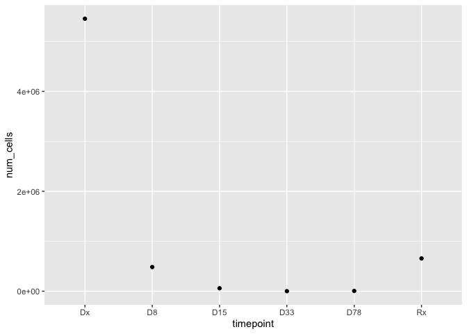
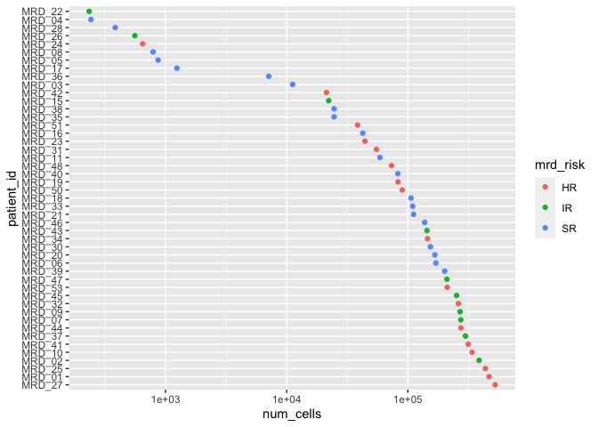
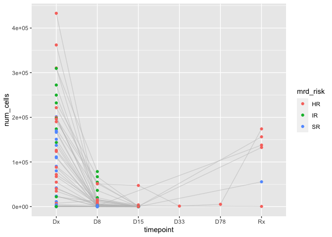
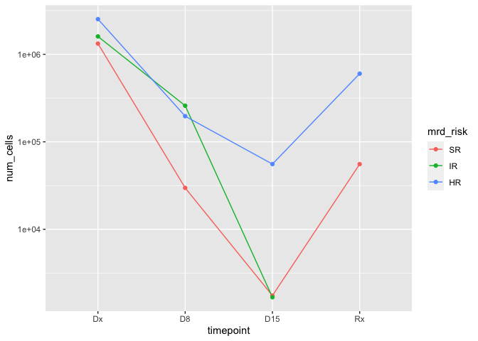

Loading and Preprocessing MRD dataset
================

``` r
# libraries
library(flowCore)
library(tidyverse)
```

    ## ── Attaching packages ─────────────────────────────────────── tidyverse 1.3.0 ──

    ## ✓ ggplot2 3.3.3     ✓ purrr   0.3.4
    ## ✓ tibble  3.0.5     ✓ dplyr   1.0.3
    ## ✓ tidyr   1.1.2     ✓ stringr 1.4.0
    ## ✓ readr   1.4.0     ✓ forcats 0.5.0

    ## ── Conflicts ────────────────────────────────────────── tidyverse_conflicts() ──
    ## x dplyr::filter() masks flowCore::filter(), stats::filter()
    ## x dplyr::lag()    masks stats::lag()

``` r
library(tidytof)
library(readxl)
library(keras)
```

    ## 
    ## Attaching package: 'keras'

    ## The following object is masked from 'package:flowCore':
    ## 
    ##     normalize

``` r
# parameters
data_path <- here::here("data-raw", "data")
md_path <- here::here("data-raw", "Metadata.xlsx")

timepoint_levels <- c("Dx", "D8", "D15", "D33", "D78", "Rx")
risk_levels <- c("SR", "IR", "HR")
```

# Read in data

``` r
# metadata
metadata <- 
  md_path %>% 
  read_excel() %>% 
  janitor::clean_names()

metadata
```

    ## # A tibble: 145 x 5
    ##    file_name                    plate_run patient_id timepoint mrd_risk
    ##    <chr>                        <chr>     <chr>      <chr>     <chr>   
    ##  1 Plate1_MRD_02_D8_blasts.fcs  Plate1    MRD_02     D8        IR      
    ##  2 Plate1_MRD_02_Dx_blasts.fcs  Plate1    MRD_02     Dx        IR      
    ##  3 Plate1_MRD_03_Dx_blasts.fcs  Plate1    MRD_03     Dx        SR      
    ##  4 Plate1_MRD_05_D15_blasts.fcs Plate1    MRD_05     D15       SR      
    ##  5 Plate1_MRD_05_Dx_blasts.fcs  Plate1    MRD_05     Dx        SR      
    ##  6 Plate2_MRD_06_D8_blasts.fcs  Plate2    MRD_06     D8        SR      
    ##  7 Plate2_MRD_06_Dx_blasts.fcs  Plate2    MRD_06     Dx        SR      
    ##  8 Plate2_MRD_09_D8_blasts.fcs  Plate2    MRD_09     D8        IR      
    ##  9 Plate2_MRD_09_D15_blasts.fcs Plate2    MRD_09     D15       IR      
    ## 10 Plate2_MRD_09_Dx_blasts.fcs  Plate2    MRD_09     Dx        IR      
    ## # … with 135 more rows

``` r
# single-cell data

# function to clean channel names
clean_channels <- function(channel_name){ 
  new_name <- 
    channel_name %>% 
    str_to_lower() %>% 
    str_extract("_.+$") %>% 
    str_sub(start = 2L)
  }

all_data <- 
  data_path %>% 
  tof_read_fcs()

colnames(all_data)
```

    ##  [1] "Time"             "Event_length"     "89Y"              "102Pd_BC1"       
    ##  [5] "104Pd_BC2"        "105Pd_BC3"        "106Pd_BC4"        "108Pd_BC5"       
    ##  [9] "110Pd_BC6"        "113In_CD235_CD61" "115In_CD45"       "127I"            
    ## [13] "139La_cParp"      "141Pr_pSrc"       "142Nd_CD19"       "143Nd_CD22"      
    ## [17] "144Nd_p4EBP1"     "145Nd_CD73"       "146Nd_CD66"       "147Sm_CD20"      
    ## [21] "148Sm_CD34"       "149Sm_CD179a"     "150Sm_pSTAT5"     "151Eu_GCR"       
    ## [25] "152Sm_Ki67"       "153Eu_IgMi"       "154Gd_CD123"      "155Gd_pBLNK"     
    ## [29] "156Gd_CD10"       "157Gd_pBTK"       "158Gd_CD179b"     "159Tb_pAKT"      
    ## [33] "160Gd_CD24"       "161Dy_TSLPr"      "162Dy_CD127"      "163Dy_CD81"      
    ## [37] "164Dy_Tdt"        "165Ho_PAX5"       "166Er_CD13"       "167Er_CD43"      
    ## [41] "168Er_CD38"       "169Tm_CD304"      "170Er_CD3"        "171Yb_pSyk"      
    ## [45] "172Yb_pS6"        "173Yb_pErk"       "174Yb_HLA-DR"     "175Lu_IgMs"      
    ## [49] "176Yb_pCREB"      "191Ir_DNA1"       "193Ir_DNA2"       "195Pt_Cisplatin" 
    ## [53] "209Bi_CD16_CD33"  "Center"           "Offset"           "Width"           
    ## [57] "Residual"         "beadDist"         "file_name"

We can see that the all data has some irrelevant channels. We can filter
them out.

``` r
all_data <- 
  all_data %>% 
  rename_with(.fn = clean_channels, .cols = contains("_")) %>% 
  rename_with(.fn = str_to_lower) %>% 
  rename(file_name = name) %>% 
  select(
    -time, 
    -length, 
    -`127i`, 
    -`89y`, 
    -dna1, 
    -dna2, 
    -width, 
    -residual, 
    -offset, 
    -beaddist,
    -center, 
    -cd16_cd33,
    -cd235_cd61, 
    -cisplatin, 
    -contains("bc")
  )

colnames(all_data)
```

    ##  [1] "cd45"      "cparp"     "psrc"      "cd19"      "cd22"      "p4ebp1"   
    ##  [7] "cd73"      "cd66"      "cd20"      "cd34"      "cd179a"    "pstat5"   
    ## [13] "gcr"       "ki67"      "igmi"      "cd123"     "pblnk"     "cd10"     
    ## [19] "pbtk"      "cd179b"    "pakt"      "cd24"      "tslpr"     "cd127"    
    ## [25] "cd81"      "tdt"       "pax5"      "cd13"      "cd43"      "cd38"     
    ## [31] "cd304"     "cd3"       "psyk"      "ps6"       "perk"      "hla-dr"   
    ## [37] "igms"      "pcreb"     "file_name"

# Preprocessing

We can also preprocess the data with the asinh transformation and by
removing the noise that the cytof software adds to every set of counts.

``` r
all_data <- 
  all_data %>%
  tof_preprocess()
```

In order to put the data through a feedforward network, we will also
have to scale/center each feature (cell-wise).

# Integrate single-cell and metadata

From here, we can annotate each cell with some variables from the
metadata table `md`.

``` r
all_data <- 
  all_data %>% 
  left_join(y = metadata, by = "file_name")

all_data
```

    ## # A tibble: 6,989,850 x 43
    ##     cd45 cparp  psrc  cd19  cd22 p4ebp1  cd73  cd66  cd20  cd34 cd179a pstat5
    ##    <dbl> <dbl> <dbl> <dbl> <dbl>  <dbl> <dbl> <dbl> <dbl> <dbl>  <dbl>  <dbl>
    ##  1  3.45 0.199 0.199  2.19 0.390  0.199 0.390 0.733 0.199 0.199   2.09  0.390
    ##  2  3.63 0.733 0.199  1.88 0.569  1.25  0.733 0.733 0.199 0.390   4.16  0.199
    ##  3  3.43 0.881 0.390  2.49 0.390  0.390 0.733 1.02  0.199 0.199   1.99  0.569
    ##  4  3.55 0.199 0.390  3.33 0.199  1.99  1.61  0.733 0.390 0.199   3.06  0.199
    ##  5  3.44 0.199 1.14   3.36 0.199  1.88  0.199 0.569 0.569 0.199   2.09  0.199
    ##  6  3.04 0.199 0.569  2.85 0.881  0.199 0.569 0.390 0.199 0.733   2.09  0.569
    ##  7  3.52 0.569 0.569  2.42 0.390  0.199 1.02  0.881 0.199 0.199   1.99  0.569
    ##  8  4.20 0.199 0.390  3.43 0.569  2.05  0.199 0.199 0.199 0.733   2.82  0.199
    ##  9  3.47 0.390 0.390  3.00 0.569  1.82  1.02  0.733 0.199 0.199   3.07  0.390
    ## 10  3.38 0.881 0.390  2.39 0.390  1.99  0.199 0.199 0.199 0.199   3.60  0.199
    ## # … with 6,989,840 more rows, and 31 more variables: gcr <dbl>, ki67 <dbl>,
    ## #   igmi <dbl>, cd123 <dbl>, pblnk <dbl>, cd10 <dbl>, pbtk <dbl>, cd179b <dbl>,
    ## #   pakt <dbl>, cd24 <dbl>, tslpr <dbl>, cd127 <dbl>, cd81 <dbl>, tdt <dbl>,
    ## #   pax5 <dbl>, cd13 <dbl>, cd43 <dbl>, cd38 <dbl>, cd304 <dbl>, cd3 <dbl>,
    ## #   psyk <dbl>, ps6 <dbl>, perk <dbl>, `hla-dr` <dbl>, igms <dbl>, pcreb <dbl>,
    ## #   file_name <chr>, plate_run <chr>, patient_id <chr>, timepoint <chr>,
    ## #   mrd_risk <chr>

We can also make one more data structure that will be useful later.

``` r
# create an easy lookup for which patients have which mrd risk
patient_risk <- 
  all_data %>% 
  select(patient_id, mrd_risk) %>% 
  distinct() %>% 
  drop_na()

patient_risk
```

    ## # A tibble: 48 x 2
    ##    patient_id mrd_risk
    ##    <chr>      <chr>   
    ##  1 MRD_02     IR      
    ##  2 MRD_03     SR      
    ##  3 MRD_05     SR      
    ##  4 MRD_37     IR      
    ##  5 MRD_38     SR      
    ##  6 MRD_41     HR      
    ##  7 MRD_40     SR      
    ##  8 MRD_42     HR      
    ##  9 MRD_43     IR      
    ## 10 MRD_45     IR      
    ## # … with 38 more rows

## Leveling factors

We can also put some factors in order (like `timepoint` and `mrd_risk`)
when they have a natural interpretation as “ordered.”

``` r
all_data <- 
  all_data %>% 
  mutate(
    timepoint = factor(timepoint, levels = timepoint_levels), 
    mrd_risk = factor(mrd_risk, levels = risk_levels)
  )
```

# Some quick EDA

## number of patients

``` r
num_patients <- 
  all_data %>% 
  count(patient_id) %>% 
  nrow()
```

We have samples from 48 unique patients.

## Number of samples

``` r
num_samples <- 
  all_data %>% 
  count(file_name) %>% 
  nrow()
```

There are a total of 145 samples. This means that each patient has
multiple samples taken (at different timepoints)

## Number of patients in each risk group

``` r
all_data %>% 
  count(patient_id, mrd_risk) %>% 
  count(mrd_risk, name = "num_patients")
```

    ## # A tibble: 4 x 2
    ##   mrd_risk num_patients
    ## * <fct>           <int>
    ## 1 SR                 20
    ## 2 IR                 10
    ## 3 HR                 17
    ## 4 <NA>                1

Here, we can see that one patient doesn’t have an mrd risk assessment.
So, we can omit the cells from this patient in the rest of our analysis.

``` r
all_data <- 
  all_data %>% 
  filter(mrd_risk != "n.a.")
```

## Number of patients at each timepoint

``` r
all_data %>% 
  count(patient_id, timepoint) %>% 
  count(timepoint, name = "num_patients") %>% 
  arrange(-num_patients)
```

    ## # A tibble: 6 x 2
    ##   timepoint num_patients
    ##   <fct>            <int>
    ## 1 Dx                  47
    ## 2 D8                  44
    ## 3 D15                 43
    ## 4 Rx                   6
    ## 5 D33                  1
    ## 6 D78                  1

So we can see that only 1 patient has the Day 33 and Day 78 time points,
and most have only 3 timepoints: - Dx - D8 - D15

In addition, it seems that 6 patients also have samples from the relapse
timepoint.

## Number of cells per timepoint

``` r
all_data %>% 
  mutate(timepoint = factor(timepoint, levels = timepoint_levels)) %>% 
  count(timepoint, name = "num_cells") %>% 
  ggplot(aes(x = timepoint, y = num_cells)) + 
  geom_point()
```

<!-- -->

So we can see that we have way more cells at the first timepoint on
average than at the later timepoints (with a resurgence at relapse).

## Number of cells per patient

``` r
patient_cells <- 
  all_data %>% 
  count(patient_id, name = "num_cells") %>% 
  left_join(patient_risk, by = "patient_id") %>% 
  mutate(patient_id = fct_reorder(patient_id, -num_cells)) %>% 
  arrange(-num_cells)

patient_cells
```

    ## # A tibble: 47 x 3
    ##    patient_id num_cells mrd_risk
    ##    <fct>          <int> <chr>   
    ##  1 MRD_27        526176 HR      
    ##  2 MRD_01        468720 HR      
    ##  3 MRD_25        437168 HR      
    ##  4 MRD_02        388080 IR      
    ##  5 MRD_10        339321 HR      
    ##  6 MRD_41        315801 HR      
    ##  7 MRD_37        299615 IR      
    ##  8 MRD_44        275129 HR      
    ##  9 MRD_07        273734 IR      
    ## 10 MRD_09        270227 IR      
    ## # … with 37 more rows

``` r
patient_cells %>% 
  ggplot(aes(x = patient_id, y = num_cells, color = mrd_risk)) + 
  geom_point() + 
  scale_y_log10() + 
  coord_flip()
```

<!-- -->

So we can see that some patients have a very small number of cells
(several hundred) whereas some patients have up to 500K.

## Number of cells per patient per timepoint

``` r
patient_timepoint_df <- 
  all_data %>% 
  count(patient_id, timepoint, name = "num_cells") %>% 
  left_join(patient_risk, by = "patient_id") %>% 
  mutate(timepoint = factor(timepoint, levels = timepoint_levels)) %>% 
  arrange(-num_cells)

patient_timepoint_df 
```

    ## # A tibble: 142 x 4
    ##    patient_id timepoint num_cells mrd_risk
    ##    <chr>      <fct>         <int> <chr>   
    ##  1 MRD_25     Dx           433040 HR      
    ##  2 MRD_27     Dx           362060 HR      
    ##  3 MRD_41     Dx           310558 HR      
    ##  4 MRD_02     Dx           309589 IR      
    ##  5 MRD_07     Dx           272305 IR      
    ##  6 MRD_09     Dx           249752 IR      
    ##  7 MRD_37     Dx           232293 IR      
    ##  8 MRD_44     Dx           221551 HR      
    ##  9 MRD_39     Dx           201346 SR      
    ## 10 MRD_10     Dx           199850 HR      
    ## # … with 132 more rows

``` r
patient_timepoint_df %>% 
  ggplot(aes(x = timepoint, y = num_cells, color = mrd_risk)) + 
  geom_line(aes(group = patient_id), color = "gray", alpha = 0.5) + 
  geom_point()
```

<!-- -->

It would probably be useful to look at these plots as a percentage of
blasts relative to the entire sample.

## Number of cells per risk group

``` r
all_data %>% 
  count(mrd_risk, name = "num_cells") %>% 
  arrange(-num_cells)
```

    ## # A tibble: 3 x 2
    ##   mrd_risk num_cells
    ##   <fct>        <int>
    ## 1 HR         3387312
    ## 2 IR         1861775
    ## 3 SR         1413171

## Number of cells per risk group per timepoint

``` r
risk_timepoint <- 
  all_data %>% 
  count(mrd_risk, timepoint, name = "num_cells") %>% 
  arrange(timepoint, -num_cells)

risk_timepoint 
```

    ## # A tibble: 13 x 3
    ##    mrd_risk timepoint num_cells
    ##    <fct>    <fct>         <int>
    ##  1 HR       Dx          2527870
    ##  2 IR       Dx          1601417
    ##  3 SR       Dx          1326158
    ##  4 IR       D8           258687
    ##  5 HR       D8           196349
    ##  6 SR       D8            29719
    ##  7 HR       D15           55651
    ##  8 SR       D15            1745
    ##  9 IR       D15            1671
    ## 10 HR       D33            1155
    ## 11 HR       D78            5194
    ## 12 HR       Rx           601093
    ## 13 SR       Rx            55549

``` r
risk_timepoint %>% 
  filter(timepoint %in% c("Dx", "D8", "D15", "Rx")) %>% 
  ggplot(aes(x = timepoint, y = num_cells, color = mrd_risk)) + 
  geom_line(aes(group = mrd_risk)) + 
  geom_point() + 
  scale_y_log10()
```

<!-- -->

We can see that the high-risk patients tend to have the highest number
of blasts, which makes sense. And from the plot immediately above, we
can also see that high-risk and standard-risk groups tend to have the
highest number of cells especially at the D8 and D15 timepoints, and
that HR is higher at relapse than IR.

# Save the data

Then we can save the pre-processed data for use later.

``` r
all_data %>% 
  write_rds(file = here::here("data", "all_data.rds"))
```
